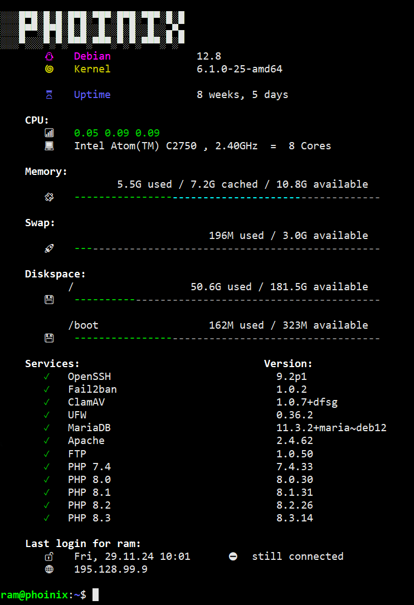

# motd-on-acid

[](https://github.com/x70b1/motd-on-acid/actions)
[](https://github.com/x70b1/motd-on-acid/graphs/contributors)
[](https://github.com/rvalitov/motd-on-acid/blob/master/LICENSE)

A nice dynamic MOTD for your server.



Modifications from the original repository:
- most icons are preconfigured and use standard emojis, as a result, no need to patch your default font with icons
- new default configuration that is fast to execute and does not slow down the SSH login process 
- easier setup and documentation improvements

## Setup
Below are the steps to install and configure the script on your system. Tested with Debian 12 Bookworm.

1. Install dependencies.
   ```console
   apt-get update
   apt-get install jq figlet toilet-fonts -y
   ```

2. Download `motd-on-acid.sh` and save it as `~/.bashrc_motd` on your server.

3. Edit `.bashrc` file and add the following lines to the end:
    ```sh
    # example snippet for your .bashrc:
    
    if [ -n "$SSH_CONNECTION" ] && [ $SHLVL -eq 1 ] && [[ $- == *i* ]]; then
        if [ -z "$MOTD" ] || [ "$MOTD" -ne 0 ]; then
            source ~/.bashrc_motd
    
            BANNER_FONTPATH="pagga"
    
            bash_motd --banner --cpu --memory --swap --diskspace --services --login
        fi
    fi
    ```
4. Update ssh server configuration. If you use latest OpenSSH, create a new file `motd.conf` in `/etc/ssh/sshd_config.d/` with the  content below, otherwise add the content to `/etc/ssh/sshd_config`:
```
AcceptEnv MOTD
PrintMotd no
Banner none
PrintLastLog no
```

5. Update PAM settings. Disable or remove all `pam_motd.so` PAM includes in `/etc/pam.d/sshd`:
```
# session    optional     pam_motd.so  motd=/run/motd.dynamic
# session    optional     pam_motd.so noupdate
```
6. Download file `.bashrc_motd_services.txt` and save it in your home directory. 
   Edit it to include the services you want to monitor. More details [here](#modifying-front-matter) 
 
## Notes:
- You can run `export MOTD=0; ssh -o SendEnv=MOTD -t host.name.net` to disable MOTD. That is useful if you run `ssh` commands in scripts.


## Customizations
- You can change the icons and colors in the script. The default configuration is optimized for the most common use cases.
- You can check fonts for banners at https://devhints.io/figlet. The default font is `pagga`. The list of fonts installed by default is [here](https://packages.debian.org/bookworm/all/toilet-fonts/filelist). You can install extra fonts if needed.

### Modules
| Name   | Argument | Description                                                    | Enabled By Default | Default Icons Configured |
|--------|----------|----------------------------------------------------------------|--------------------|--------------------------|
| Banner | `--banner`  | Prints a banner, linux distribution, kernel version and uptime | [x]                | [x]                      |
| CPU    |     `--cpu`     | Prints the `loadavg` threshold and hardware info               | [x]                | [x]                      |
| RAM    |      `--memory`    | Prints a usage bar for your memory                             | [x]                | [x]                      |
| Swap   |     `--swap`     | Prints a usage bar as summary for your swap space              | [x]                | [x]                      |
| Disk   |     `--diskspace`     | Prints a usage bar for all mounted filesystems                | [x]                | [x]                      |
| Services | `--services` | Prints the status of a defined list of `systemd` services       | [x]                | [x]                      |
| Login | `--login` | Prints the previous login time, logout time and IP of your current user | [x]                | [x]                      |
| Podman | `--podman` | Prints the status of your local `podman` containers | [ ]                | [ ]                      |
| Docker | `--docker` | Prints the status of your local `docker` containers | [ ]                | [ ]                      |
| Updates | `--updates` | Prints your available linux distribution updates | [ ]                | [ ]                      |
| Letsencrypt | `--letsencrypt` | Prints the expiration status of all your certs | [ ]                | [ ]                      |
| Include | `--include` | Create your own script and print it on your MOTD | [ ]                | [ ]                      |

### Additional configuration for some modules:
#### Services
Create a file `.bashrc_motd_services.txt` with the contents of the services you want to monitor.
File structure:

1. The printed name [required]
2. `systemd` service name [required]
3. `dpkg` or `rpm` package name for version info [not required, will print `--` if empty]

The separator is`;`. Example:

```
OpenSSH;ssh;openssh-server
Fail2ban;fail2ban;fail2ban
ClamAV;clamav-daemon;clamav
UFW;ufw;ufw
MariaDB;mysql;mariadb-server
Apache;apache2;apache2
FTP;pure-ftpd-mysql;pure-ftpd-mysql
PHP 7.4;php7.4-fpm;php7.4-fpm
PHP 8.0;php8.0-fpm;php8.0-fpm
PHP 8.1;php8.1-fpm;php8.1-fpm
PHP 8.2;php8.2-fpm;php8.2-fpm
PHP 8.3;php8.3-fpm;php8.3-fpm
```

#### Podman

You have to add `podman` to the `/etc/sudoers` for your user:

```
username ALL=(ALL) NOPASSWD: /usr/bin/podman version --format json
username ALL=(ALL) NOPASSWD: /usr/bin/podman images --format json
username ALL=(ALL) NOPASSWD: /usr/bin/podman pod ls --sort name --format json
```

#### Docker

You have to add `curl` to the `/etc/sudoers` for your user:

```
username ALL=(ALL) NOPASSWD: /usr/bin/curl -sf --unix-socket /var/run/docker.sock http\:/v1.40/info
username ALL=(ALL) NOPASSWD: /usr/bin/curl -sf --unix-socket /var/run/docker.sock http\:/v1.40/containers/json?all=true
```

#### LetsEncrypt

You have to add `find` and `openssl` to the `/etc/sudoers` for your user and add path to your certs:

```
username ALL=(ALL) NOPASSWD: /usr/bin/find </your/path/to/ssl> -name cert.pem
username ALL=(ALL) NOPASSWD: /usr/bin/openssl
```
